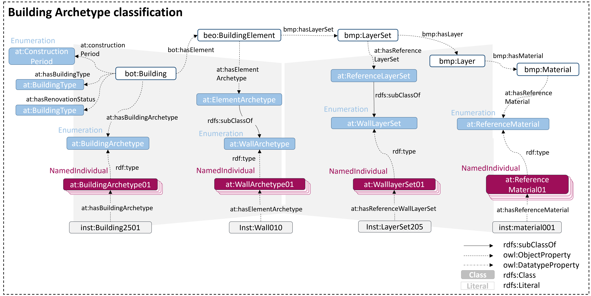

# AT_Archetype Ontology for existig building materials

The Archetype Ontology for building engineering domain classifies buildings, building elements, layersets, and materials that can be assigned to existing building stock. As such, the classes offer to assign average values defined by typical building characteristics and serve as reasonable approximations when detailed building-specific data is unavailable.

Web Documentation
https://w3id.org/at#
HTML documentation https://julkaltenegger.github.io/at/ 

### Core Ontology

